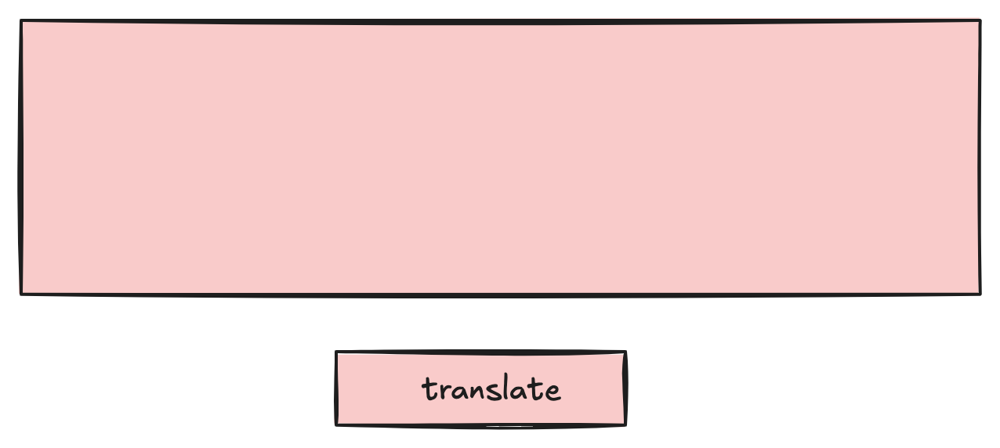

# Corporate Jargon Translator

A demonstration repository for building a corporate jargon translator using large language models. This is a deliberately simple project to make it easier to read and comprehend what's going on.

In the hopes that this will be useful for others, I'm doing the work in steps, and using branches to separate the steps so tha you can follow along.

This is the main branch, the beginning of the project.  It's effectively an empty repository that you can build on or follow, choose-your-own-adventure style from here.

## Where to?

I'm aiming for something very simple -- a bare bones UI, and integration with a large language model. In order to make it easy to work with the model, I'm going to start with a simple UI, like this:

You're welcome to pick a technology stack and get started building in the way that you're most familiar with, or you can follow one of the paths I've already started.

If you want to follow, you can choose from the following paths:

- Next.js
  - You could build the user interface (shown above) using Next.js and then compare it to what I built 
  - Or simply switch to the [nextjs](/codiform/jargon-translator/tree/nextjs) branch and look at my implementation

I will likely build out other paths, but this is the first available.

## Discuss
