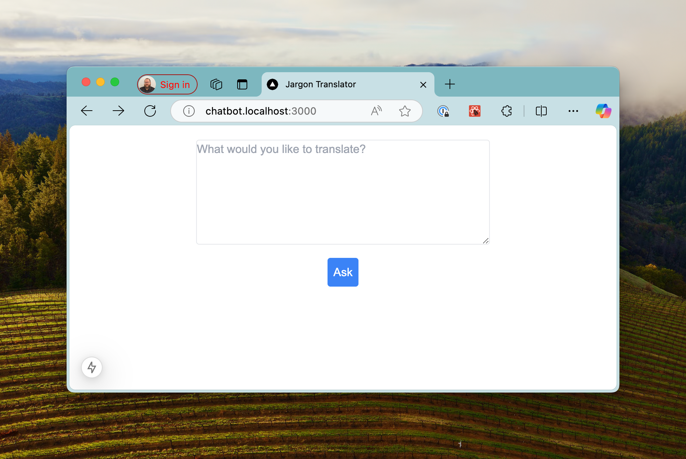
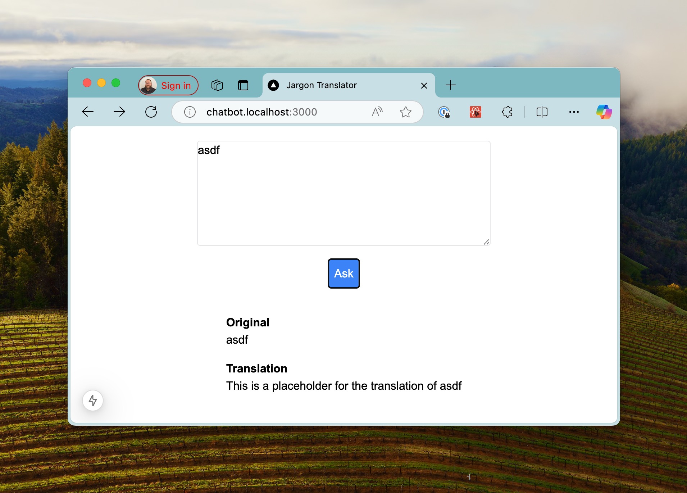
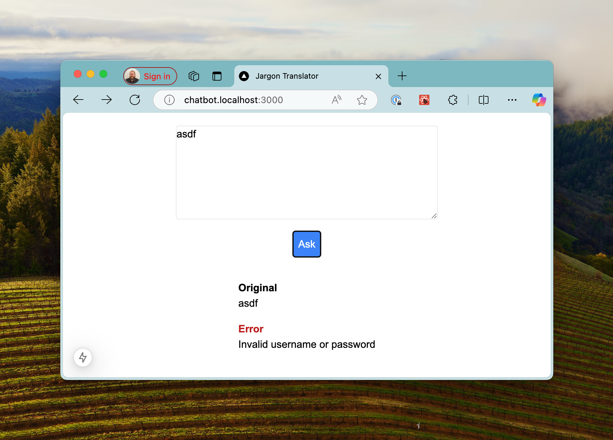

# Corporate Jargon Translator

A demonstration repository for building a corporate jargon translator using large language models. This is a deliberately simple project to make it easier to read and comprehend what's going on.

In the hopes that this will be useful for others, I'm doing the work in steps, and using branches to separate the steps so tha you can follow along.

## Branches
If you want to start at the beginning, start with the [main branch](https://github.com/codiform/jargon-translator/).

If you want to jump forward to one of the next steps:
- The [nextjs-bedrock](https://github.com/codiform/jargon-translator/tree/nextjs-bedrock) branch adds a simple integration to Claude 3.5 Haiku in Amazon Bedrock.
- The [nextjs-ghm](https://github.com/codiform/jargon-translator/tree/nextjs-ghm) branch uses GitHub Models and GPT 4o-mini to translate

I will likely add other branches here as well. I'm going to look at GitHub Models next, since it looks like that may allow me to deploy a demo site (with quotas) so that people can try it.

## This Branch: NextJS 

This branch adds a NextJS front end to the project.  It's a very simple front-end: a text area and a button, as well as output:

This is just a UI, the LLM hasn't been integrated yet. To ensure the front end doesn't break, there's a placeholder API route that will randomly return a placeholder translation or error:

## Running the project
You can run it in dev mode using one of the standard commands from your tool of choice (`yarn dev` or `npm run dev` or `pnpm dev`), and you may need to install dependencies first (`npm install` or `yarn install` or `pnpm install`).

