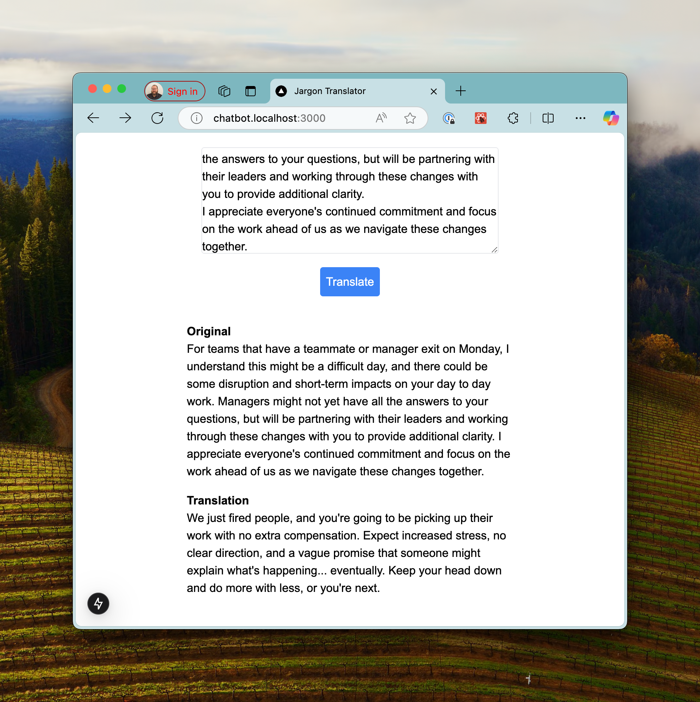

# Corporate Jargon Translator

A demonstration repository for building a corporate jargon translator using large language models. This is a deliberately simple project to make it easier to read and comprehend what's going on.

In the hopes that this will be useful for others, I'm doing the work in steps, and using branches to separate the steps so tha you can follow along.

## Branches
If you want to start at the beginning, start with the [main branch](https://github.com/codiform/jargon-translator/).

If you want to go back to the initial implementation of Next.js without the LLM integrated through Amazon Bedrock, try the [nextjs](https://github.com/codiform/jargon-translator/tree/nextjs) branch.

There are still more enhancements that could be made here:
- Streaming
  - This would allow the LLM tokens to appear on screen as they're being generated, which is pretty standard for a chatbot-style interface.
- Converse / Chat
  - The current implementation is deliberately simplistic -- anything in the texbox is the statement to be translated. This does mean you can't easily guide the LLM to improve the translation.
- Read from Web
  - Rather than pasting snippets from a web page, what if you could translate a whole webpage, or ask the LLM to read a PR statement and at least provide a short (and darkly humorous) translation of the whole thing? 

If you want to try making some of those enhancements, feel free to submit a pull request. Otherwise, maybe I'll come back to those or other topics.

## This Branch: NextJS + Bedrock

This branch builds on the [nextjs](https://github.com/codiform/jargon-translator/tree/nextjs) branch, which built a front-end using Next.js, but didn't integrate with any LLMs.

This branch adds the LLM integration using Amazon Bedrock:
- The model I've used is Claude 3.5 Haiku using a `modelId` that works for me here in `ca-central-1`.
- The authentication is not part of the code, so if you want to try this out, you'll need to have AWS credentials configured, request model access, make sure the modelId works for you ...
- If you are having troubles running the demo, raise an issue and I'll see if I can help, or open up discussions on the repository.

This is what a translation of a recent Meta layoff leak looks like:

## Running the Demo
You may need to install dependencies (`npm install` / `yarn install` /br `pnpm install`) before running.

Once the packages are installed, you can run it in dev mode (`npm run dev` / `yarn dev` / `pnpm dev`) and then open your browser to [http://localhost:3000](http://localhost:3000).

If you don't already have AWS credentials set up, you may need to configure that using the aws configuration file, environment variables, etc. If you haven't interacted with bedrock, you may need to request access to models, and so on.